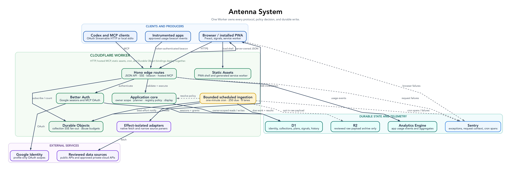

# Antenna

A source-aware personal signal layer for people and agents.

Antenna collects live signals into private collections, preserves provenance and
freshness, and exposes the same governed context through a web application and
the Model Context Protocol (MCP). A Cloudflare Worker remains the authority for
authentication, source policy, persistence, planning, and connector dispatch.



## Why Antenna?

Agents are more useful when they can read current, trustworthy context without
copy-and-paste. Antenna makes that context inspectable:

- every value includes its source and freshness
- private, shared-link, and public reads are enforced server-side
- connectors are pure adapters with explicit configuration schemas
- unsupported requests become setup requests instead of unsafe arbitrary fetches
- MCP clients use the same ownership and policy boundaries as the browser

## Status

Antenna is an early open-source release intended for self-hosting and
experimentation. Private collections and owner-scoped MCP access are the primary
surfaces. Review the [security model](docs/SECURITY_PRIVACY.md) and
[source-policy contract](docs/SPEC.md#source-policy) before operating a public
instance.

## Stack

- Cloudflare Workers, D1, R2, Durable Objects, Analytics Engine, and Assets
- Hono, Better Auth, Drizzle ORM, and Zod
- Preact, Vite, Tailwind CSS, and Playwright
- TypeScript MCP server for local stdio and hosted HTTP access

## Local development

Requirements:

- Node.js 22 or later
- npm
- Graphviz for diagram verification
- a Google OAuth client for interactive sign-in

```sh
cp .env.example .env
cp apps/worker/.dev.vars.example apps/worker/.dev.vars
npm ci
npm run db:migrate:local --workspace=apps/worker
npm run build
npm run dev --workspace=apps/worker
```

The local Worker runs at `http://localhost:8787`. Set the Google OAuth redirect
URI to `http://localhost:8787/api/auth/callback/google`.

For a test-only session that does not use Google OAuth, follow the E2E setup in
[CONTRIBUTING.md](CONTRIBUTING.md). The bypass is ignored whenever
`NODE_ENV=production`.

## Deploying

Antenna is infrastructure-dependent and intentionally does not ship a production
deployment target. Before deploying:

1. Create your own D1 database and R2 bucket.
2. Replace the placeholder resource identifiers in
   `apps/worker/wrangler.toml`.
3. Set the Worker URL and optional custom route.
4. configure Google OAuth and the secrets documented in
   [docs/SECRETS.md](docs/SECRETS.md).
5. Apply D1 migrations, build the web and MCP packages, then deploy.

See [docs/SELF_HOSTING.md](docs/SELF_HOSTING.md) for the complete sequence.

## Repository map

- `apps/worker` — HTTP API, auth, persistence, cron dispatch, source gates
- `apps/web` — Preact single-page application
- `apps/mcp` — MCP server and token CLI
- `packages/connectors` — pure source adapters
- `packages/registry` — connector templates and source policy
- `packages/shared` — shared wire types and validation schemas
- `tests/e2e` — Playwright browser tests
- `docs/diagrams` — Graphviz sources and rendered architecture diagrams

## Quality gates

```sh
npm run verify
npm run test:contracts
npm run test:e2e
npm run check:bundle
npm run audit:security
```

`npm run verify` checks formatting, documentation links, import boundaries,
public-release isolation, lint, types, generated skill content, MCP build smoke
tests, diagrams, prompt parity, and unit tests. Maintainers publishing a
sanitised release from a private deployment should follow the
[public release contract](docs/PUBLIC_RELEASE.md).

## Security

Please report vulnerabilities privately as described in
[SECURITY.md](SECURITY.md). Do not open a public issue for a suspected
vulnerability.

## Licence

MIT. See [LICENSE](LICENSE).
