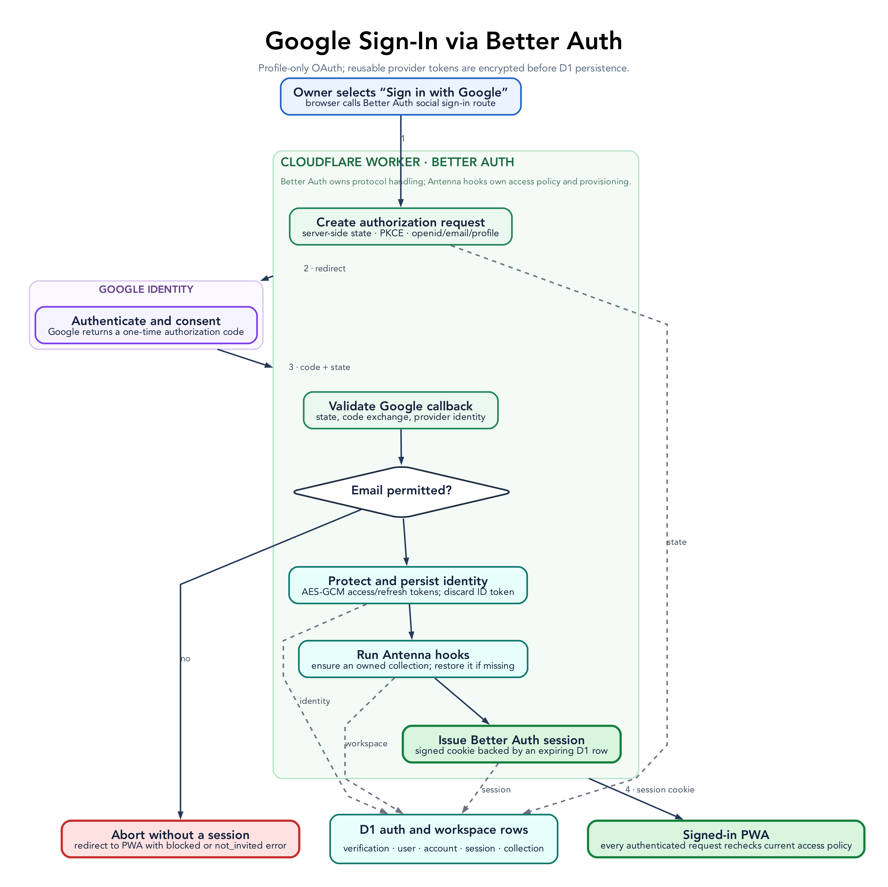
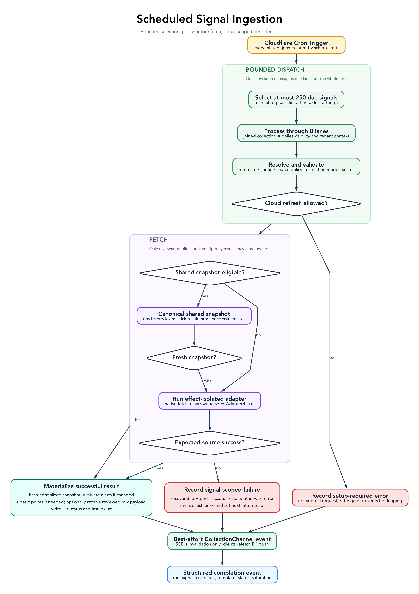
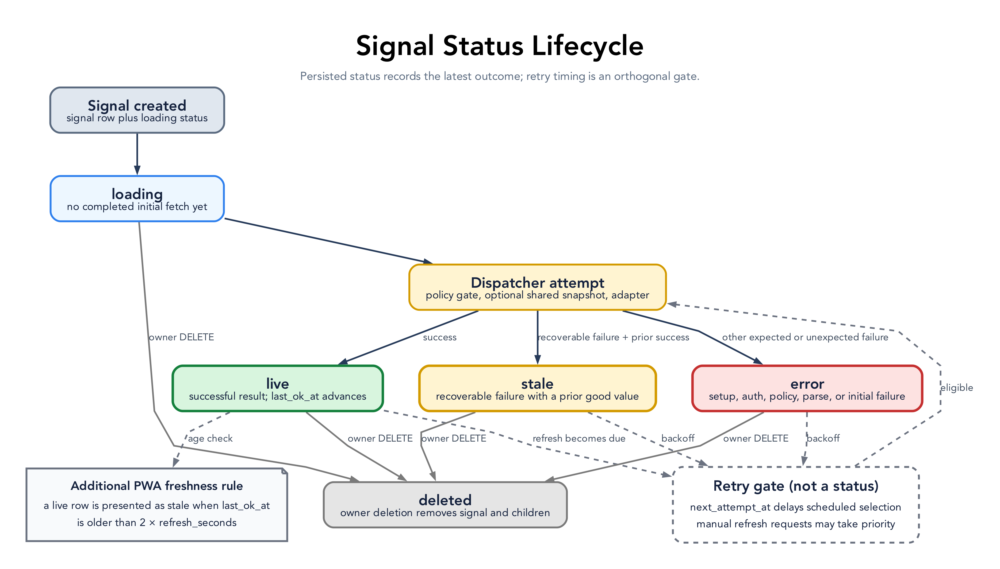
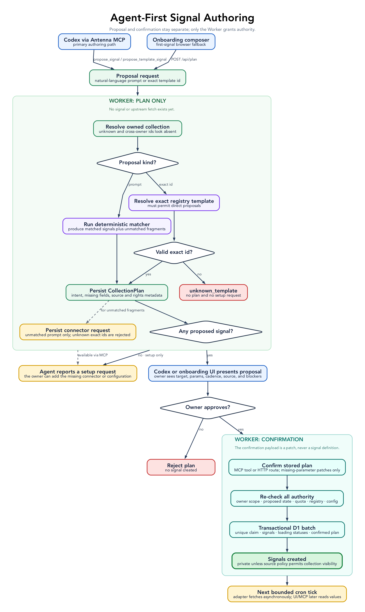
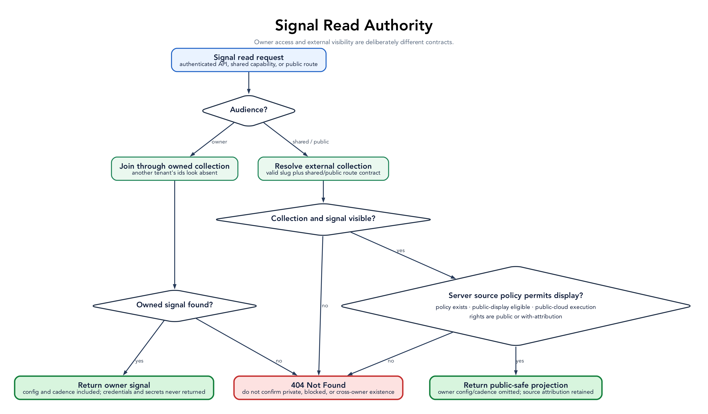

# Antenna architecture

This document owns system shape and recurring implementation patterns. It intentionally omits route
and column catalogues: `apps/worker/src/index.ts`, shared schemas, D1 migrations, and registry output
are the exact authorities for volatile detail.

## System Shape

The repository is one npm workspace:

| Area                  | Responsibility                                                                 |
| --------------------- | ------------------------------------------------------------------------------ |
| `apps/worker`         | Hono API, Better Auth, policy, D1/R2 writes, cron, SSE, rate limits, telemetry |
| `apps/web`            | Preact PWA, collection workspace, arrangement, slideshow, offline snapshot     |
| `apps/mcp`            | shared MCP factory, Worker transport handlers, local stdio client              |
| `packages/connectors` | effect-isolated source fetch and normalization                                 |
| `packages/registry`   | connector templates, source/display policy, collection templates, alerts       |
| `packages/shared`     | wire types, error codes, and Zod request/response schemas                      |
| `skills/antenna`      | operational playbook for an agent using the MCP                                |

The Worker and static assets deploy together to an operator-controlled Worker origin. D1 is
durable application truth. R2 holds only source-reviewed raw payload archives. Analytics Engine holds aggregate app
usage events. Durable Objects provide one SSE fan-out channel per collection and one authoritative
counter per rate-limit key.

## Technology Choices

- **Cloudflare Worker + Hono** keeps API, scheduled dispatch, auth, assets, and MCP on one runtime.
- **D1 + Drizzle** suits the small relational, owner-scoped workload while keeping SQL migrations
  explicit.
- **Preact + Signals + Vite** keeps the installable visual workspace small without introducing a
  second server-rendering system.
- **Better Auth** owns Google OAuth, sessions, and MCP OAuth protocol behavior; Antenna adds account
  policy and token-at-rest controls around it.
- **Static TypeScript registry + Zod** makes connector authority reviewable and deploy-versioned.
- **Native `fetch` adapters** avoid framework-specific connector clients and remain easy to test.

Do not add a queue, DB-backed plugin registry, SSR framework, connector SDK, or second application
backend pre-emptively. Reconsider the current choices when measured limits justify it—for example,
dispatch regularly saturates its bounded slice, D1 locality materially harms users, or independent
connector deployment becomes a real operational requirement.

## Patterns

These are implementation contracts. [CODING_STYLE.md](CODING_STYLE.md) turns them into package and
review rules.

| Pattern                      | Rule                                                                                                                                                                                                                                      |
| ---------------------------- | ----------------------------------------------------------------------------------------------------------------------------------------------------------------------------------------------------------------------------------------- |
| Server-owned authority       | The Worker re-resolves template identity, source rights, execution mode, visibility eligibility, display metadata, and refresh limits. Clients submit intent and allowed patches.                                                         |
| Inward dependencies          | Apps depend on public package surfaces; packages never depend on apps; web never imports registry or Worker code. `packages/shared` is the wire-contract leaf.                                                                            |
| Effect-isolated adapter      | A connector may fetch and observe time. It cannot persist, cache, retry, authorize users, notify, or inspect collection state. Expected source failures become `AdapterResult`; unexpected failures may throw to the invocation boundary. |
| Owner-scoped query           | Authenticated signal, plan, and collection operations constrain access through `collections.ownerId`; cross-owner identifiers look absent.                                                                                                |
| Validate then mutate         | Narrow HTTP/MCP input and persisted JSON, re-resolve server authority, validate the complete result, then perform the first write.                                                                                                        |
| Typed expected failure       | Expected product states use a closed `ApiErrorCode` or discriminated result. Unexpected platform/programmer failures reach top-level telemetry. Human detail is separate from stable codes.                                               |
| Fail closed                  | Unknown ownership, policy, rights, execution mode, config, or cached shape denies dispatch or external visibility.                                                                                                                        |
| Explicit write consistency   | Use D1 `batch()` for coupled writes that must commit together. Test/local fallbacks must compensate or be safely retryable; multi-step workflows are idempotent.                                                                          |
| Bounded background work      | Autonomous work caps selection and concurrency, orders fairly, records attempts, and applies source-aware retry delay.                                                                                                                    |
| Policy-gated shared fetch    | Only reviewed `public_cloud`, config-only, non-archiving fetches may reuse an upstream snapshot. Owner points, status, history, and alerts remain separate.                                                                               |
| Canonical versioned identity | Cache keys and data hashes use sorted canonical JSON. Cached projections carry a connector snapshot version that changes with their shape.                                                                                                |
| State hierarchy              | D1/R2 are durable truth; SSE is invalidation; browser signals are working state; an owner-keyed local snapshot is best-effort offline presentation only.                                                                                  |
| Structured observability     | Runtime events are one JSON object per line with an `event` discriminator and joinable run/signal/template identifiers. Never log secrets, config, request bodies, or unnecessary PII.                                                    |
| Migration-owned schema       | `schema.ts` mirrors current code; numbered SQL migrations are deployment truth. Transforming migrations execute their real SQL in a focused test.                                                                                         |
| Earned module split          | Keep one concern flat. Split by behavior when independent responsibilities or tests emerge; do not add empty repository/service layers.                                                                                                   |
| Shared interaction lifecycle | Menus and dialogs reuse dismissal/focus hooks and guard dismissal during writes; components own content, hooks own global listener cleanup.                                                                                               |

## Durable Model

The exact schema is `apps/worker/src/db/schema.ts`; numbered files in `apps/worker/drizzle` are the
deployed migration sequence.

| Domain             | Durable records                                               | Main invariant                                                                                               |
| ------------------ | ------------------------------------------------------------- | ------------------------------------------------------------------------------------------------------------ |
| Identity           | Better Auth `user`, `account`, `session`, `verification`      | Google credentials are encrypted before persistence; ID tokens are discarded.                                |
| Agent auth         | OAuth application/access/consent tables; legacy `mcp_tokens`  | Grants are owner-scoped and revocable; successful refresh retires the consumed grant.                        |
| Workspace          | `collections`, `signals`, layouts, visits, starter dismissals | Collection ownership is the tenant boundary; layouts reference signals in that collection.                   |
| Observations       | `signal_points`, `signal_status`, `signal_alerts`             | Points are idempotent by signal, observation time, and metric; status records attempt/success/retry state.   |
| Shared fetch cache | `upstream_snapshots`                                          | Normalized points only, for eligible public-cloud sources, keyed by canonical config and projection version. |
| Authoring          | `collection_plans`, confirmation claims, connector requests   | Plans preserve intent; one unique claim makes confirmation single-use.                                       |
| Operations         | Analytics Engine `app_usage`; R2 payload objects              | Usage is aggregate. Raw payload retention is opt-in, source-reviewed, signal-keyed, and lifecycle-limited.   |
| Compatibility      | historical publication/report/notification tables             | Older migration chains may retain them; their runtimes are retired.                                          |

Registry templates are code, not rows. D1 records what an owner configured and what ran; the
registry records what the deployed application permits.

## Request And Authority Boundaries

`apps/worker/src/index.ts` composes route modules in this order:

1. security headers and top-level exception handling;
2. unauthenticated health/share shell and OAuth discovery;
3. rate-limited Better Auth and MCP OAuth routes;
4. rate-limited public/shared reads and machine-authenticated usage ingest;
5. session/MCP authentication for every remaining `/api/*` route;
6. owner route modules and finally static asset fallback.

| Surface                                                              | Authority                                                                  |
| -------------------------------------------------------------------- | -------------------------------------------------------------------------- |
| `/api/auth/*`, `/.well-known/*`                                      | Better Auth protocol routes plus anonymous registration/start limits       |
| `/api/public/*`, `/api/shared/*`, `/c/:slug`                         | anonymous direct-link reads gated by collection, signal, and source policy |
| `/api/beacon`                                                        | deployment bearer token; writes aggregate events only                      |
| `/api/collections`, `/api/collection`, `/api/signals`, `/api/alerts` | authenticated, owner-scoped workspace reads and writes                     |
| `/api/plan`, `/api/templates`, `/api/requests`                       | server-owned authoring and connector-demand trail                          |
| `/api/mcp`, connection/token routes                                  | MCP transport and owner credential management                              |
| `/healthz`, `/api/healthz`                                           | anonymous runtime liveness and authenticated end-to-end health             |

All expected API failures use `{ error: ApiErrorCode, detail?, ... }`; HTTP status retains transport
meaning. Shared schemas in `packages/shared` define wire contracts. Route code and tests, rather than
this table, own exact methods and fields.

## Authentication

Google OAuth requests only identity scopes. Better Auth persists users and sessions in D1. Reusable
Google access and refresh tokens are AES-GCM encrypted through Web Crypto before storage; the ID
token is not retained.

`ALLOWED_EMAILS` is an optional deployment allowlist; `BLOCKED_EMAILS` always wins. Policy is checked
during user/session creation and on every authenticated request, so a newly refused account loses
browser and MCP access immediately. `ADMIN_EMAILS` is separate and gates only aggregate
deployment-wide operational data.

Auth hooks idempotently provision a first private collection. If a `seed-collection` exists, its
signal definitions are cloned without status or points; cron fetches fresh owner-specific data.
Returning users are not silently reconciled on sign-in.

MCP OAuth uses Better Auth's server metadata and grant tables. A successful refresh retires the
consumed grant; owners may disconnect a client, removing its grants and consent. Expired grants are
cleaned hourly, followed by abandoned registrations after their safety window.

Workers Static Assets may bypass application code for ordinary assets, so `wrangler.toml` sends API,
health, share, and OAuth discovery paths through the Worker first. `apps/web/public/_headers` applies
the matching browser security policy to static responses.

## Scheduled Ingestion

The cron runs every minute. Its dispatcher selects due rows in SQL, puts manual requests first and
then least-recently-attempted work, caps a tick at 250 signals, and processes up to eight upstream
calls concurrently.

For each row it:

1. resolves ownership, template, config schema, source policy, and required server secret;
2. fails closed before fetch when any authority is missing;
3. reuses an eligible stored/in-flight public-cloud snapshot or calls the adapter;
4. normalizes and hashes the complete snapshot, writing changed points or a daily checkpoint;
5. optionally archives a reviewed raw payload, evaluates alert rules, and writes status;
6. best-effort notifies the collection channel.

Stored snapshots are reusable only when they are newer than half the requesting signal's refresh
interval. Failed fetches are never cached. Raw-payload templates never share fetches. Connectors bump
`snapshotVersion` whenever their normalized projection changes.

Expected adapter failures update status. A recoverable failure after prior success is `stale`; an
initial or unrecoverable failure is `error`. Adapter-provided retry delay wins; rate-limit/auth
failures back off, and missing setup backs off longer. Manual refresh can override the retry gate.
Unexpected failures propagate to the invocation boundary and telemetry rather than being mislabeled
as an upstream product state.

Points age out under template retention policy (180 days by default). Reviewed R2 payloads expire
after 365 days through bucket lifecycle policy. Stale shared snapshots and expired points are purged
daily in isolated periodic jobs.

## Live And Browser State

Each collection maps to one `CollectionChannel` Durable Object. The authenticated SSE route verifies
ownership before subscribing. Dispatcher notifications contain invalidation information only; the
browser refetches the owner API. Notifications never determine durable state and never block cron.

After repeated stream failures the browser polls every 30 seconds and defensively refetches after a
minute of silence. A local snapshot is keyed to the current owner and collection, validated on read,
and used only for offline presentation.

## Signal Authoring

`apps/worker/src/planner` implements deterministic matching, plan persistence, confirmation, and
connector requests. One prompt may produce several proposed signals and unmatched fragments. Exact
template proposals and natural-language proposals both persist a plan before any signal exists.

Confirmation loads the plan through an owned collection, claims it once, accepts edits only for
configuration fields marked missing, re-resolves all template authority from the registry, validates
the final configs, writes loading signals, and marks the plan confirmed. No client-supplied display,
rights, source, template, or cadence field is authoritative.

Unmatched fragments persist as connector requests with server-owned acquisition/blocker metadata.
That metadata informs implementation work but grants no fetch permission.

## External Reads And Shared Fetches

Owner reads require collection ownership but may show the owner's private or credentialed sources.
Anonymous reads combine collection visibility, signal visibility, reviewed rights,
`publicDisplayEligible`, and `public_cloud` execution mode. Unavailable collection slugs return
`404`; ineligible signals are omitted. Responses omit config, refresh cadence, and owner controls.

The same execution-mode boundary controls cross-owner upstream reuse. A user-provided URL, manual
value, deployment manifest, or credentialed API can never become shared/public merely because a
browser labels it that way.

## Deploy And Operations

Public CI runs secret scanning, verification, the production security audit, the bundle budget, and
Playwright. It deliberately has no deployment job or production credentials. Operators apply
migrations and deploy their own Worker by following [SELF_HOSTING.md](SELF_HOSTING.md).

Secret and environment setup lives in [SECRETS.md](SECRETS.md). Security review rules live in
[SECURITY_PRIVACY.md](SECURITY_PRIVACY.md).
